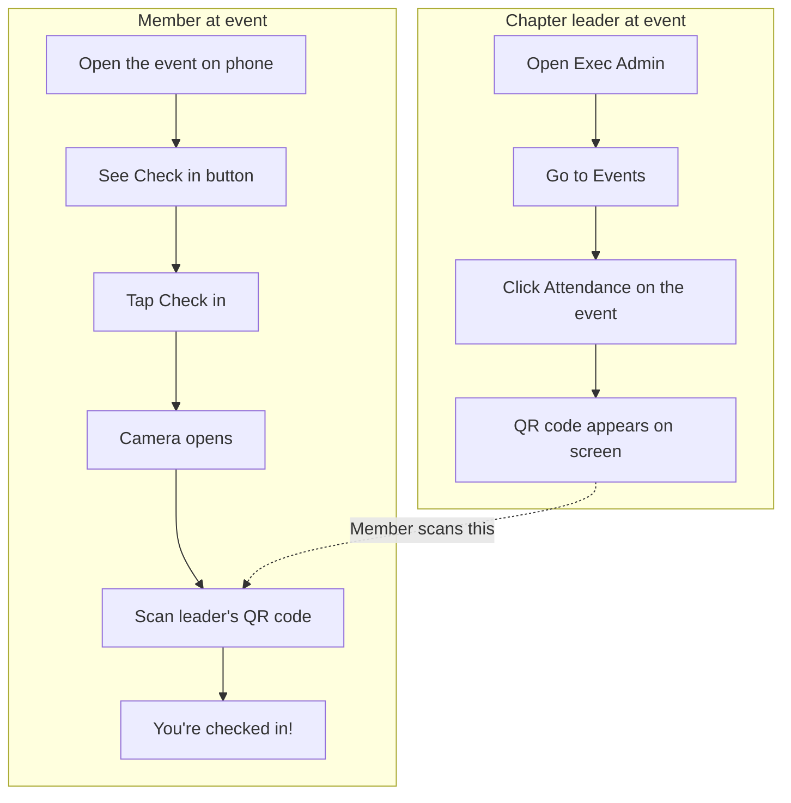

# Event Check-In

Members can check in at events by scanning a code with their phone. Chapter leaders display the code; members scan it in the app.

## Flow Overview

---

## How to Use

### For chapter leaders (displaying the code)

1. Sign in and go to **Exec Admin**.
2. Open **Events**.
3. Find your event and click **Attendance**.
4. A QR code appears. Leave it on screen so members can scan it.
5. Use the refresh button to see who has checked in.

### For members (checking in)

1. Open the **Calendar** or **Events** tab on your phone.
2. Tap the event that’s happening.
3. During the event time, you’ll see a **Check in** button.
4. Tap **Check in**.
5. Allow camera access when prompted.
6. Point your camera at the QR code on the leader’s screen.
7. When it’s successful, you’ll see **You’re checked in!**

---

## How to Test

1. **As a leader:** Create or pick an event with a start time in the past and end time in the future (so it’s “occurring now”). Open Attendance and confirm the QR code shows.
2. **As a member:** On a phone, open that same event. Confirm the **Check in** button appears. Tap it, allow the camera, and scan the leader’s QR. Confirm you see **You’re checked in!**
3. **As a leader:** Refresh the Attendance list and confirm the member appears as checked in.

---

## Fallback: Check in on web

If the camera doesn’t work, members can use the **Having trouble? Check in on web** link. They’ll go to `/dashboard/check-in?event={id}` where they can tap **Check in** to record attendance (no scan needed). The page shows the standard dashboard header and mobile bottom navigation, with a **Back to events** link to return.
