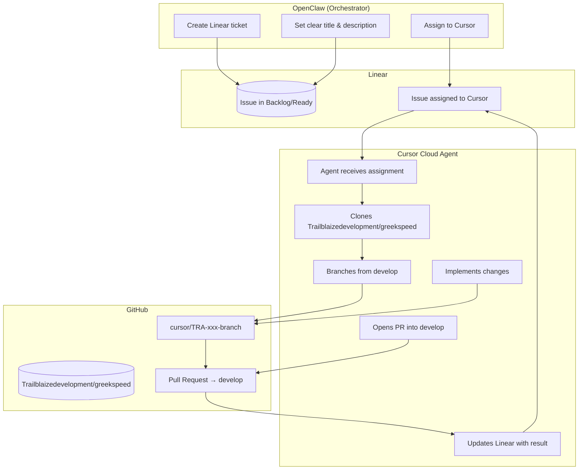

# Linear ↔ Cursor Workflow

This document describes how Linear and Cursor Cloud Agents work together for automated code development. **OpenClaw** orchestrates by creating and assigning Linear tickets; **Cursor** performs the actual code changes.

---

## Flow Overview



---

## Step-by-Step

| Step | Actor | Action |
|------|-------|--------|
| 1 | OpenClaw | Create Linear issue with clear title, description, and acceptance criteria |
| 2 | OpenClaw | Assign the issue to **Cursor** (or use "Delegate to Cursor") |
| 3 | Cursor | Receives assignment, spins up Cloud Agent |
| 4 | Cursor | Clones `Trailblaizedevelopment/greekspeed`, branches from `develop` with prefix `cursor/` |
| 5 | Cursor | Implements changes, commits, pushes branch |
| 6 | Cursor | Opens PR into `develop`, posts summary in Linear |
| 7 | Human / OpenClaw | Reviews PR, merges when ready |

---

## OpenClaw Responsibilities

- **Create tickets** in Linear with enough context for Cursor to implement
- **Assign to Cursor** — this is the trigger that starts the Cloud Agent
- **Do minimal code changes** unless absolutely necessary; Cursor handles implementation
- Optionally add per-issue overrides in the description (see below)

---

## Ticket Best Practices

For Cursor to implement effectively:
**→ Use the [Linear Ticket Template](./LINEAR_TICKET_TEMPLATE.md) when creating issues.**


---

## Optional Per-Issue Overrides

Add these in the issue description or a comment if needed:

| Syntax | Purpose |
|--------|---------|
| `[repo=Trailblaizedevelopment/greekspeed]` | Override default repo (rarely needed) |
| `[branch=feature-name]` | Custom branch name |
| `[model=claude-3.5-sonnet]` | Override AI model |

---

## Cursor Configuration (Reference)

| Setting | Value |
|---------|-------|
| Default Repository | `Trailblaizedevelopment/greekspeed` |
| Base Branch | `develop` |
| Branch Prefix | `cursor/` |
| Create PRs | Enabled |

---

## Branch Naming

Cursor creates branches like: `cursor/TRA-158-add-edit-posts`

- Prefix: `cursor/`
- Linear issue ID: `TRA-158`
- Slug from issue title

---

## What Happens After Cursor Finishes

1. Cursor posts a comment in the Linear issue with a summary and PR link
2. PR is open in GitHub: `Trailblaizedevelopment/greekspeed` targeting `develop`
3. Human or OpenClaw reviews and merges
4. Merge to `develop` deploys to `greekspeed.vercel.app`
5. Merge `develop` → `main` deploys to `trailblaize.net`

---

```mermaid
flowchart TD
    A[OPENCLAW (Orchestrator)]
    B[LINEAR]
    C[CURSOR (Code Executor)]
    D[HUMAN]

    A -->|Create tickets, Triage, Assign| B
    B -->|Backlog → Agent Ready → Assigned to Cursor → In Review → Done| C
    C -->|Clone repo, Branch, Implement, Commit, Push, PR| D
    D -->|Review PR, Merge to develop,<br/>Staging deploy,<br/>Merge to main for prod| D

    %% Optional: comments (not rendered nodes)
    %% A: • Create tickets from specs/ideas<br/>• Triage: add AC, add agent-ready label<br/>• Assign to Cursor → Cursor Cloud Agent starts<br/>• Monitor PRs, optionally update Linear state
    %% B: Linear workflow states
    %% C: • Clone Trailblaizedevelopment/greekspeed<br/>• Branch cursor/TRA-xxx-description from develop<br/>• Implement, commit, push<br/>• Open PR → develop, comment in Linear
    %% D: • Review PR, merge to develop<br/>• Staging auto-deploys<br/>• Merge develop → main for production
```
